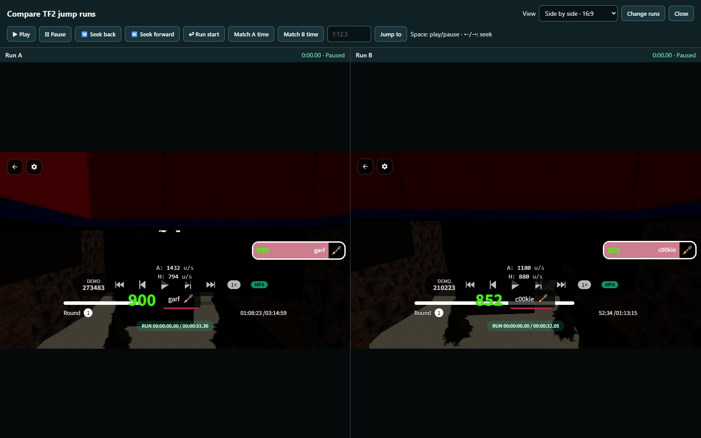
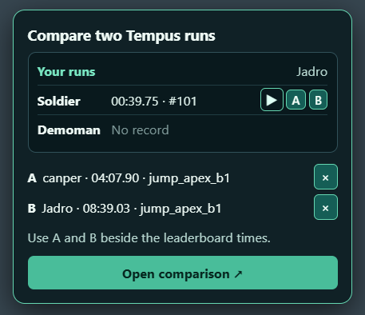
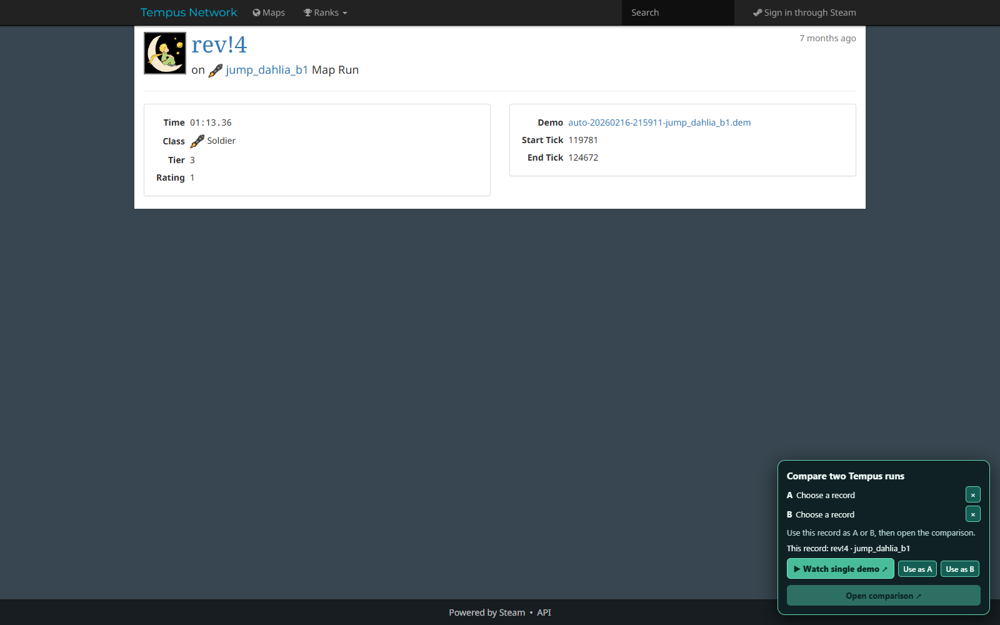

# TF2 Jump Demo SyncView

A small Chrome and Edge extension for watching [Tempus](https://tempus2.xyz/) TF2 jump records in [demos.tf2jump.xyz](https://demos.tf2jump.xyz/) and comparing two runs with synchronized controls.



## Features

- Pick Run A and Run B directly from a Tempus map leaderboard.
- Find your own map records immediately when you are signed in to Tempus, even when they are outside the first 50 leaderboard results.
- Open any Tempus record in the demo viewer with one click.
- Paste Tempus record links, demo viewer links, or plain record IDs.
- Play, pause, seek, change playback speed, and return both demos to the run start together.
- Match one viewer to the other if their times drift apart.
- Jump both runs to a specific time such as `12.5` or `1:12.5`.
- Choose side by side, ultrawide, stacked, or fill layouts.
- Start each replay with its view-options panel collapsed while keeping the gear button available.
- Use `Space` for play/pause and `←` / `→` to seek both demos.

## Install

This extension is installed manually and does not require a browser store.

1. [Download the latest ZIP](https://github.com/Jadro20/tf2-jump-demo-syncview/archive/refs/heads/main.zip).
2. Extract the ZIP to a permanent folder. Keep that folder after installation.
3. Open your browser's extensions page:
   - Chrome: `chrome://extensions`
   - Edge: `edge://extensions`
4. Enable **Developer mode**.
5. Click **Load unpacked** and select the extracted folder that contains `manifest.json`.
6. Refresh any Tempus or demos.tf2jump.xyz tabs that were already open.

The extension should now show a **Compare runs** button on demos.tf2jump.xyz and a comparison panel on Tempus map and record pages.

## Use it

### Compare two records from a Tempus map

Open a map on Tempus and select **Map Run**. Every record receives an **A** and **B** button. Pick one record for each side, then click **Open comparison**.

The two demos open paused at their run starts. Use the clearly labeled **Linked replay controls** above them to control both at once.

### Quickly select your own record

**You must be signed in to Tempus for Your runs to appear.** When signed in, the comparison panel displays your Soldier and Demoman map records above the A/B selection. Use **A** or **B** to add your run to the comparison, or use the play button to watch it by itself.



The extension requests your record directly from Tempus, so it works even when your rank is not among the first 50 visible leaderboard entries. A record without an available demo is shown but cannot be selected for playback.

### Watch one record

Open an individual Tempus record page and click **Watch single demo** in the panel at the bottom right.



### Paste links or record IDs

Open [demos.tf2jump.xyz](https://demos.tf2jump.xyz/) and click **Compare runs**. Each input accepts any of these formats:

```text
https://tempus2.xyz/records/8758401
https://demos.tf2jump.xyz/?record=8758401&tick=683877&play=0
8758401
```

Click **Load both** after entering Run A and Run B.

## Controls

| Control | What it does |
| --- | --- |
| Play both / Pause both | Starts or pauses both demos together |
| −50 ticks / +50 ticks | Seeks both demos backward or forward |
| Run start | Returns both demos to their detected run starts |
| Speed | Sets both demos to 0.1×, 0.5×, 1×, 2×, or 3× playback |
| Match B to A | Moves Run B to Run A's current run time |
| Match A to B | Moves Run A to Run B's current run time |
| Jump both | Moves both demos to the entered run time |
| Layout | Changes how the two viewers fit on screen |

If the runs become slightly misaligned, pause them and use **Match B to A**, **Match A to B**, or **Run start**.

## Update

Download the ZIP again and replace the old files, then return to the extensions page and click **Reload** on TF2 Jump Demo SyncView. If you installed it with Git, run `git pull` in the extension folder and reload it from the extensions page.

## Privacy and permissions

The extension runs only on `tempus2.xyz` and `demos.tf2jump.xyz`. It has no extra browser permissions, analytics, or telemetry. Selected records and the preferred layout are stored locally in the browser. On Tempus map pages, it reads the signed-in player ID already stored by Tempus and requests that player's map records from the public Tempus API.

## Development

The extension is plain JavaScript with no build step or dependencies:

- `manifest.json` registers the two content scripts.
- `tempus-picker.js` adds Tempus record shortcuts and the A/B picker.
- `compare.js` adds the synchronized comparison interface.

After editing a file, reload the extension on the browser's extensions page and refresh the site.

## Notes

- A record needs an available demo to load in the viewer.
- Each demo viewer renders independently, so a small amount of drift can occur during playback. The matching controls realign them.
- This is a community project and is not affiliated with Tempus Network, TF2Jump, Valve, or Team Fortress 2.

## Support

If Tempus or demos.tf2jump.xyz changes and the extension stops working, contact me on Discord: **@jadro**.

## License

[MIT](LICENSE)
